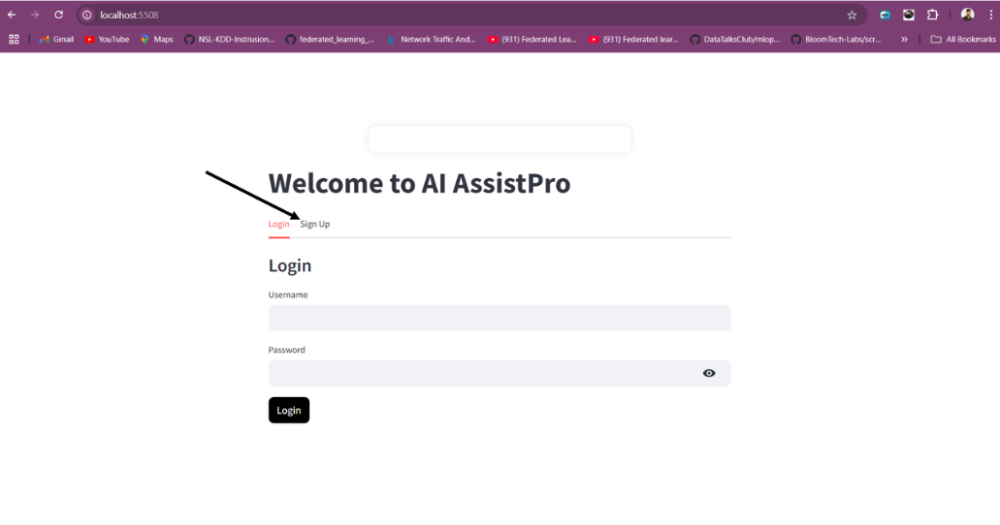
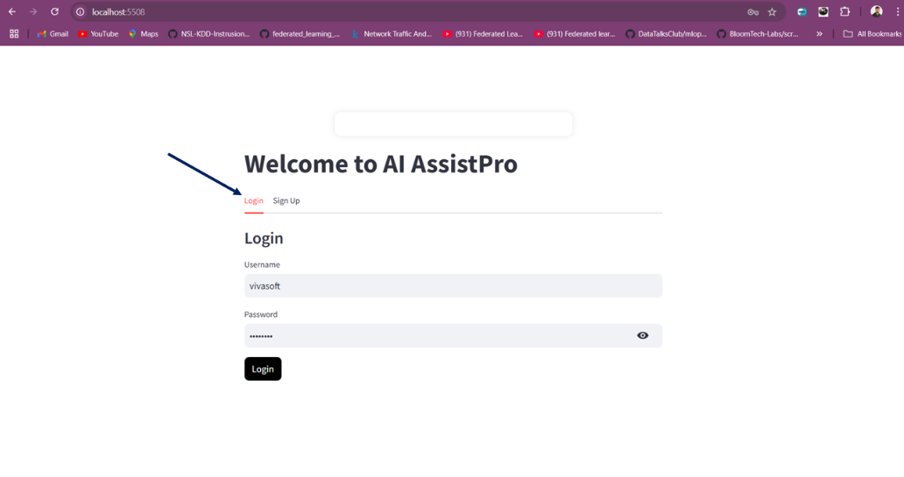
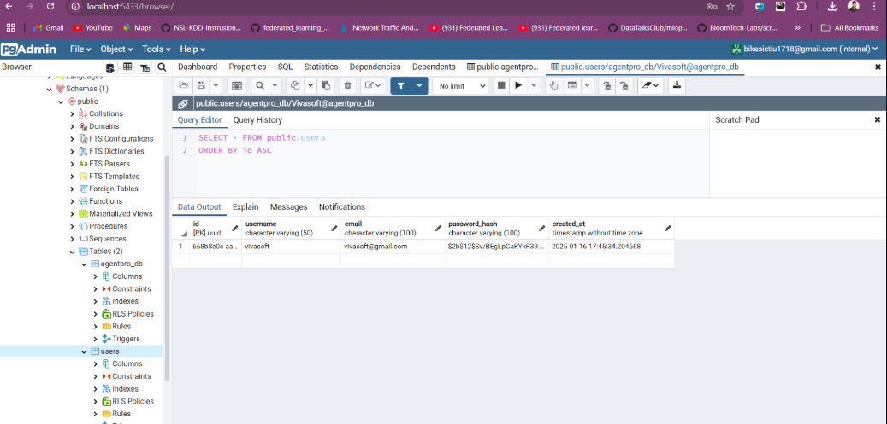
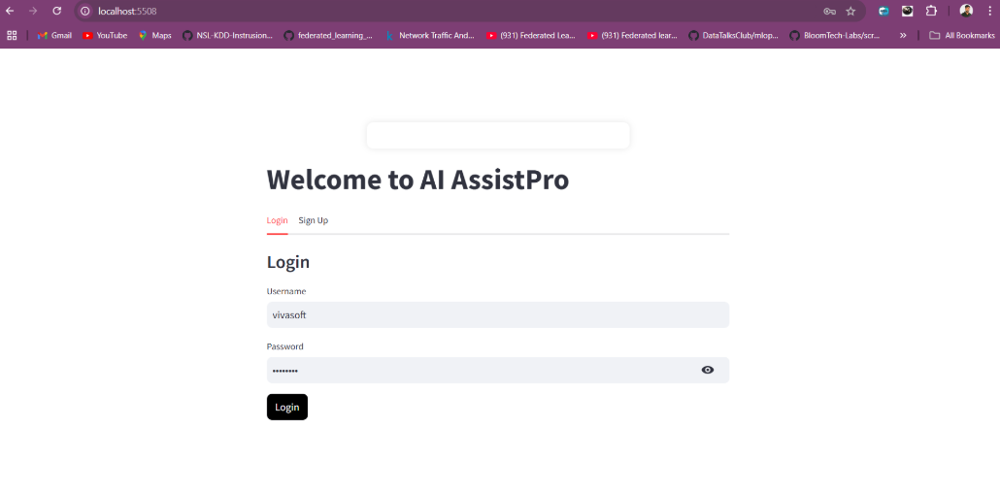
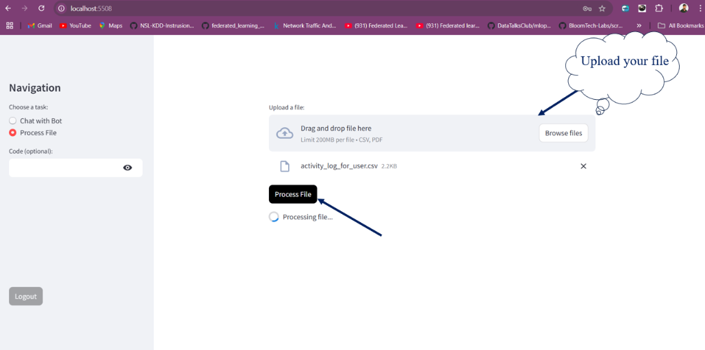
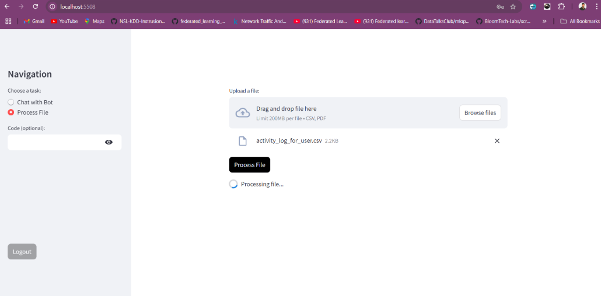
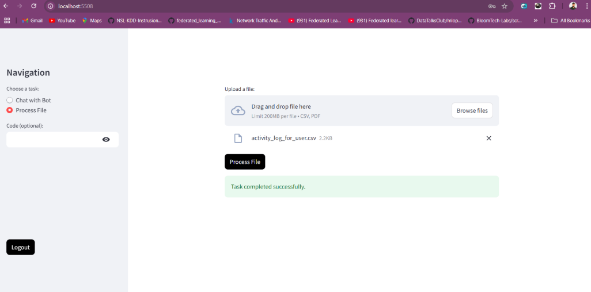
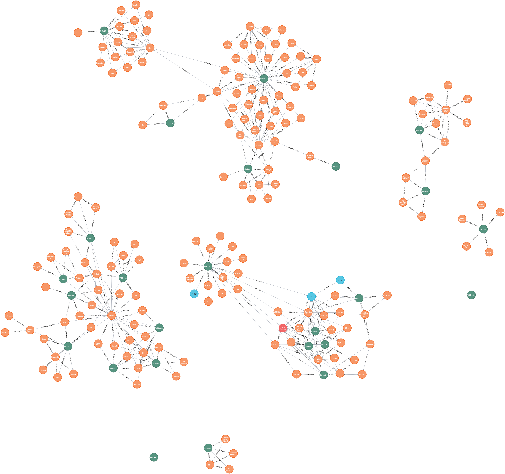
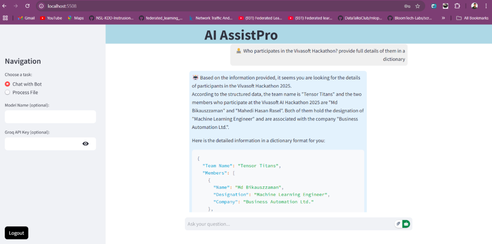
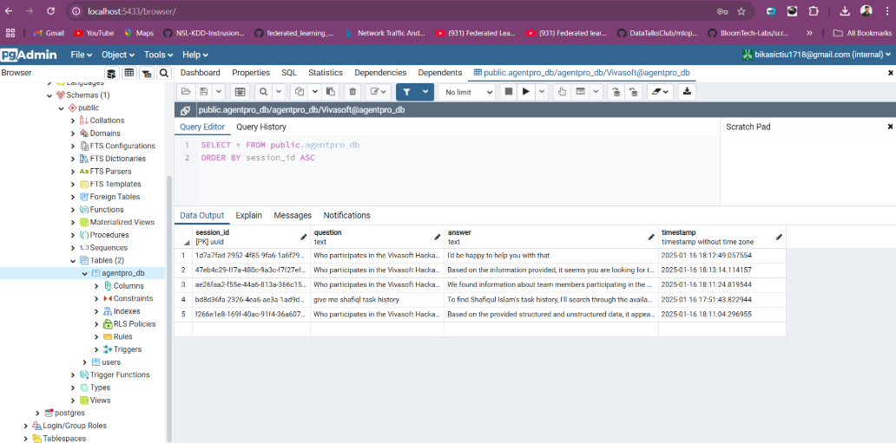

# AI AssistPro Smart Agent for Customer Interaction and Business Efficiency

A cutting-edge AI AssistPro Smart Agent for Customer Interaction system that combines the power of Neo4j Knowledge Graphs and Retrieval-Augmented Generation (RAG) to deliver highly contextual and intelligent responses. This project idea leverages the strengths of graph-based knowledge representation and retrieval-based AI to enhance chatbot performance and ensure accurate, relevant, and dynamic interactions.

<h3>Features</h3>
<ol>
  <li><b>Neo4j Knowledge Graph Integration:</b> Organizes and manages structured knowledge for enhanced context-awareness.</li>
  <li><b>Retrieval-Augmented Generation (RAG):</b> Employs a hybrid approach by retrieving knowledge graph data and combining it with generative AI for robust responses.</li>
  <li><b>Scalable Architecture:</b> Designed to scale with data size and complexity for enterprise applications.</li>
  <li><b>Dynamic Querying:</b> Uses Cypher queries to extract relevant knowledge graph data in real-time.</li>
  <li><b>API Integration:</b> Includes APIs for seamless integration with web and mobile applications.</li>
</ol>


<h3>Prerequisites</h3>
<ul>
  <li>Python 3.9 or 3.9+</li>
  <li>Libraries Installation</li>
  <li>PostgreSQL</li>
  <li>Neo4j</li>
</ul>

<h3>Keep these ports available </h3>

```bash
  Neo4j browser = 7474
  Bolt protocol = 7687
  PostgreSQL = 54032 
  pgadmin = 5433
  backend app = 5507
  frontend app = 5508

```


<h3>Installation</h3>
<ul>
  <li>Clone the repository:</li>

  ```bash
git clone https://github.com/polok-dev98/Neo4j-Driven-AI-Chatbot-with-KnowledgeGraph-and-LLM-Integration
cd  Neo4j-Driven-AI-Chatbot-with-KnowledgeGraph-and-LLM-Integration
```
</ul>

<h3>Docker Compose</h3>

```bash
docker-compose up --build -d
```

<h3>Credentials</h3>

<ul>
<li>Pgadmin Credentials</li>

```bash
Email: xyz@gmail.com
Password: password
```
<li>Postgres Database Credential</li>

```bash
Password: password2025
```

<li>Neo4j Graph Database Credential</li>

```bash
Browser_address: http://localhost:7474
Connect_URL= neo4j://localhost:7687
user: neo4j
Password: password
```


</ul>


<h3>Usage</h3>

<b>Interact with the chatbot:</b>

```bash
http://localhost:5508
```
<h4>Step by Step process for AI AssistPro with Knowledge graph and Neo4j</h4>





<h4>User Database</h4>

```bash
 http://localhost:5433
 ```







<h3>For Clear Database if you want during upload data use code: <b>7179</b></h3>







<h4>Neo4j Database after upload the data</h4>

```bash
http://localhost:7474/
```



Send a message and receive intelligent responses enriched with knowledge graph data.



<h4>Save user Conversation in the Database</h4>

```bash
 http://localhost:5433
 ```




<h3>Architecture</h3>
<ol>
  <li><b>Input Processing:</b> User queries are processed and analyzed for intent and entity extraction.</li>
  <li><b>Knowledge Retrieval:</b> Cypher queries dynamically retrieve relevant data from the Neo4j Knowledge Graph.</li>
  <li><b>Response Generation:</b> Combines retrieved data with a generative AI model for context-rich responses.</li>
  <li><b>Output Delivery:</b> Delivers the final response to the user via API or front-end application.</li>
</ol>


<h3>License</h3>

This project is licensed under the MIT License. See the LICENSE file for details.

<h3>Acknowledgments</h3>
<ul>
  <li>Neo4j</li>
  <li>LangChain</li>
  <li>Llama3.2</li>
</ul>
